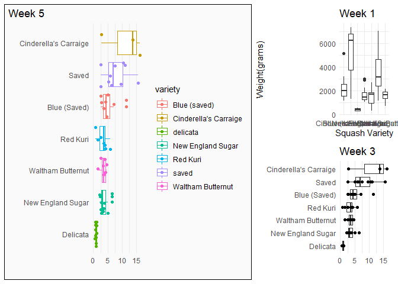

```r
library(tidyverse)     # for data cleaning and plotting
library(gardenR)       # for Lisa's garden data
library(lubridate)     # for date manipulation
library(openintro)     # for the abbr2state() function
library(palmerpenguins)# for Palmer penguin data
library(maps)          # for map data
library(ggmap)         # for mapping points on maps
library(gplots)        # for col2hex() function
library(RColorBrewer)  # for color palettes
library(sf)            # for working with spatial data
library(leaflet)       # for highly customizable mapping
library(ggthemes)      # for more themes (including theme_map())
library(plotly)        # for the ggplotly() - basic interactivity
library(gganimate)     # for adding animation layers to ggplots
library(gifski)        # for creating the gif (don't need to load this library every time,but need it installed)
library(transformr)    # for "tweening" (gganimate)
library(shiny)         # for creating interactive apps
library(patchwork)     # for nicely combining ggplot2 graphs  
library(gt)            # for creating nice tables
library(rvest)         # for scraping data
library(robotstxt)     # for checking if you can scrape data
library(paletteer)     # for color pallettes
library(rcartocolor)   # for more color options
theme_set(theme_minimal())
```


```r
# Lisa's garden data
data("garden_harvest")

#COVID-19 data from the New York Times
covid19 <- read_csv("https://raw.githubusercontent.com/nytimes/covid-19-data/master/us-states.csv")
```
[github link](https://github.com/kateliberko/Exercise6)

## Your first `shiny` app 

  1. This app will also use the COVID data. Make sure you load that data and all the libraries you need in the `app.R` file you create. Below, you will post a link to the app that you publish on shinyapps.io. You will create an app to compare states' cumulative number of COVID cases over time. The x-axis will be number of days since 20+ cases and the y-axis will be cumulative cases on the log scale (`scale_y_log10()`). We use number of days since 20+ cases on the x-axis so we can make better comparisons of the curve trajectories. You will have an input box where the user can choose which states to compare (`selectInput()`) and have a submit button to click once the user has chosen all states they're interested in comparing. The graph should display a different line for each state, with labels either on the graph or in a legend. Color can be used if needed. 
  
[My shiny App](https://katherineliberko.shinyapps.io/06_exercises/)  
## Warm-up exercises from tutorial

  2. Read in the fake garden harvest data. Find the data [here](https://github.com/llendway/scraping_etc/blob/main/2020_harvest.csv) and click on the `Raw` button to get a direct link to the data. 
  

```r
data <- read_csv("https://raw.githubusercontent.com/llendway/scraping_etc/main/2020_harvest.csv", 
                col_types = cols(weight = col_number()),
                na = "MISSING",
                skip = 2)%>%
  select(-X1)
data %>% 
  mutate(across(where(is.character), as.factor)) %>% 
  summary()
```

```
##      vegetable              variety         date         weight       units    
##  tomatoes :232   grape          : 37   9/19/20: 45   Min.   :   2   grams:685  
##  lettuce  : 68   Romanesco      : 34   8/20/20: 17   1st Qu.:  87              
##  beans    : 38   pickling       : 32   8/11/20: 16   Median : 252              
##  zucchini : 34   Lettuce Mixture: 28   8/13/20: 16   Mean   : 504              
##  cucumbers: 32   Bonny Best     : 26   8/18/20: 16   3rd Qu.: 599              
##  peas     : 27   (Other)        :525   8/4/20 : 16   Max.   :7350              
##  (Other)  :254   NA's           :  3   (Other):559   NA's   :4
```
  
  
  3. Read in this [data](https://www.kaggle.com/heeraldedhia/groceries-dataset) from the kaggle website. You will need to download the data first. Save it to your project/repo folder. Do some quick checks of the data to assure it has been read in appropriately.

```r
groceries_data <- read_csv("Groceries_dataset.csv") %>% 
  mutate(Date=dmy(Date))
```
  

  4. CHALLENGE(not graded): Write code to replicate the table shown below (open the .html file to see it) created from the `garden_harvest` data as best as you can.
  
  5. Create a table using `gt` with data from your project or from the `garden_harvest` data if your project data aren't ready.
  

```r
garden_harvest %>% 
  filter(vegetable %in% c("strawberries","peas", "lettuce", "corn", "carrots")) %>% 
  mutate(vegetable = str_to_title(vegetable),
         variety = str_to_title(variety)) %>% 
  summarise(vegetable, variety, weight) %>% 
  group_by(vegetable, variety) %>% 
  summarise(weight = sum(weight)) %>%
  
  gt(rowname_col = "variety",
    groupname_col = "vegetable") %>%
  data_color(columns = c(weight, variety),
             colors =  scales::col_factor(paletteer::paletteer_d(
        palette = "rcartocolor::Sunset" )%>% as.character(),
      domain = NULL
      )) %>%
  tab_header("Vegetable Variety by Weight")%>%
  tab_options(row_group.background.color = "lightblue")
```

```{=html}
<div id="mqxmcmdtki" style="overflow-x:auto;overflow-y:auto;width:auto;height:auto;">
<style>html {
  font-family: -apple-system, BlinkMacSystemFont, 'Segoe UI', Roboto, Oxygen, Ubuntu, Cantarell, 'Helvetica Neue', 'Fira Sans', 'Droid Sans', Arial, sans-serif;
}

#mqxmcmdtki .gt_table {
  display: table;
  border-collapse: collapse;
  margin-left: auto;
  margin-right: auto;
  color: #333333;
  font-size: 16px;
  font-weight: normal;
  font-style: normal;
  background-color: #FFFFFF;
  width: auto;
  border-top-style: solid;
  border-top-width: 2px;
  border-top-color: #A8A8A8;
  border-right-style: none;
  border-right-width: 2px;
  border-right-color: #D3D3D3;
  border-bottom-style: solid;
  border-bottom-width: 2px;
  border-bottom-color: #A8A8A8;
  border-left-style: none;
  border-left-width: 2px;
  border-left-color: #D3D3D3;
}

#mqxmcmdtki .gt_heading {
  background-color: #FFFFFF;
  text-align: center;
  border-bottom-color: #FFFFFF;
  border-left-style: none;
  border-left-width: 1px;
  border-left-color: #D3D3D3;
  border-right-style: none;
  border-right-width: 1px;
  border-right-color: #D3D3D3;
}

#mqxmcmdtki .gt_title {
  color: #333333;
  font-size: 125%;
  font-weight: initial;
  padding-top: 4px;
  padding-bottom: 4px;
  border-bottom-color: #FFFFFF;
  border-bottom-width: 0;
}

#mqxmcmdtki .gt_subtitle {
  color: #333333;
  font-size: 85%;
  font-weight: initial;
  padding-top: 0;
  padding-bottom: 4px;
  border-top-color: #FFFFFF;
  border-top-width: 0;
}

#mqxmcmdtki .gt_bottom_border {
  border-bottom-style: solid;
  border-bottom-width: 2px;
  border-bottom-color: #D3D3D3;
}

#mqxmcmdtki .gt_col_headings {
  border-top-style: solid;
  border-top-width: 2px;
  border-top-color: #D3D3D3;
  border-bottom-style: solid;
  border-bottom-width: 2px;
  border-bottom-color: #D3D3D3;
  border-left-style: none;
  border-left-width: 1px;
  border-left-color: #D3D3D3;
  border-right-style: none;
  border-right-width: 1px;
  border-right-color: #D3D3D3;
}

#mqxmcmdtki .gt_col_heading {
  color: #333333;
  background-color: #FFFFFF;
  font-size: 100%;
  font-weight: normal;
  text-transform: inherit;
  border-left-style: none;
  border-left-width: 1px;
  border-left-color: #D3D3D3;
  border-right-style: none;
  border-right-width: 1px;
  border-right-color: #D3D3D3;
  vertical-align: bottom;
  padding-top: 5px;
  padding-bottom: 6px;
  padding-left: 5px;
  padding-right: 5px;
  overflow-x: hidden;
}

#mqxmcmdtki .gt_column_spanner_outer {
  color: #333333;
  background-color: #FFFFFF;
  font-size: 100%;
  font-weight: normal;
  text-transform: inherit;
  padding-top: 0;
  padding-bottom: 0;
  padding-left: 4px;
  padding-right: 4px;
}

#mqxmcmdtki .gt_column_spanner_outer:first-child {
  padding-left: 0;
}

#mqxmcmdtki .gt_column_spanner_outer:last-child {
  padding-right: 0;
}

#mqxmcmdtki .gt_column_spanner {
  border-bottom-style: solid;
  border-bottom-width: 2px;
  border-bottom-color: #D3D3D3;
  vertical-align: bottom;
  padding-top: 5px;
  padding-bottom: 6px;
  overflow-x: hidden;
  display: inline-block;
  width: 100%;
}

#mqxmcmdtki .gt_group_heading {
  padding: 8px;
  color: #333333;
  background-color: lightblue;
  font-size: 100%;
  font-weight: initial;
  text-transform: inherit;
  border-top-style: solid;
  border-top-width: 2px;
  border-top-color: #D3D3D3;
  border-bottom-style: solid;
  border-bottom-width: 2px;
  border-bottom-color: #D3D3D3;
  border-left-style: none;
  border-left-width: 1px;
  border-left-color: #D3D3D3;
  border-right-style: none;
  border-right-width: 1px;
  border-right-color: #D3D3D3;
  vertical-align: middle;
}

#mqxmcmdtki .gt_empty_group_heading {
  padding: 0.5px;
  color: #333333;
  background-color: lightblue;
  font-size: 100%;
  font-weight: initial;
  border-top-style: solid;
  border-top-width: 2px;
  border-top-color: #D3D3D3;
  border-bottom-style: solid;
  border-bottom-width: 2px;
  border-bottom-color: #D3D3D3;
  vertical-align: middle;
}

#mqxmcmdtki .gt_from_md > :first-child {
  margin-top: 0;
}

#mqxmcmdtki .gt_from_md > :last-child {
  margin-bottom: 0;
}

#mqxmcmdtki .gt_row {
  padding-top: 8px;
  padding-bottom: 8px;
  padding-left: 5px;
  padding-right: 5px;
  margin: 10px;
  border-top-style: solid;
  border-top-width: 1px;
  border-top-color: #D3D3D3;
  border-left-style: none;
  border-left-width: 1px;
  border-left-color: #D3D3D3;
  border-right-style: none;
  border-right-width: 1px;
  border-right-color: #D3D3D3;
  vertical-align: middle;
  overflow-x: hidden;
}

#mqxmcmdtki .gt_stub {
  color: #333333;
  background-color: #FFFFFF;
  font-size: 100%;
  font-weight: initial;
  text-transform: inherit;
  border-right-style: solid;
  border-right-width: 2px;
  border-right-color: #D3D3D3;
  padding-left: 12px;
}

#mqxmcmdtki .gt_summary_row {
  color: #333333;
  background-color: #FFFFFF;
  text-transform: inherit;
  padding-top: 8px;
  padding-bottom: 8px;
  padding-left: 5px;
  padding-right: 5px;
}

#mqxmcmdtki .gt_first_summary_row {
  padding-top: 8px;
  padding-bottom: 8px;
  padding-left: 5px;
  padding-right: 5px;
  border-top-style: solid;
  border-top-width: 2px;
  border-top-color: #D3D3D3;
}

#mqxmcmdtki .gt_grand_summary_row {
  color: #333333;
  background-color: #FFFFFF;
  text-transform: inherit;
  padding-top: 8px;
  padding-bottom: 8px;
  padding-left: 5px;
  padding-right: 5px;
}

#mqxmcmdtki .gt_first_grand_summary_row {
  padding-top: 8px;
  padding-bottom: 8px;
  padding-left: 5px;
  padding-right: 5px;
  border-top-style: double;
  border-top-width: 6px;
  border-top-color: #D3D3D3;
}

#mqxmcmdtki .gt_striped {
  background-color: rgba(128, 128, 128, 0.05);
}

#mqxmcmdtki .gt_table_body {
  border-top-style: solid;
  border-top-width: 2px;
  border-top-color: #D3D3D3;
  border-bottom-style: solid;
  border-bottom-width: 2px;
  border-bottom-color: #D3D3D3;
}

#mqxmcmdtki .gt_footnotes {
  color: #333333;
  background-color: #FFFFFF;
  border-bottom-style: none;
  border-bottom-width: 2px;
  border-bottom-color: #D3D3D3;
  border-left-style: none;
  border-left-width: 2px;
  border-left-color: #D3D3D3;
  border-right-style: none;
  border-right-width: 2px;
  border-right-color: #D3D3D3;
}

#mqxmcmdtki .gt_footnote {
  margin: 0px;
  font-size: 90%;
  padding: 4px;
}

#mqxmcmdtki .gt_sourcenotes {
  color: #333333;
  background-color: #FFFFFF;
  border-bottom-style: none;
  border-bottom-width: 2px;
  border-bottom-color: #D3D3D3;
  border-left-style: none;
  border-left-width: 2px;
  border-left-color: #D3D3D3;
  border-right-style: none;
  border-right-width: 2px;
  border-right-color: #D3D3D3;
}

#mqxmcmdtki .gt_sourcenote {
  font-size: 90%;
  padding: 4px;
}

#mqxmcmdtki .gt_left {
  text-align: left;
}

#mqxmcmdtki .gt_center {
  text-align: center;
}

#mqxmcmdtki .gt_right {
  text-align: right;
  font-variant-numeric: tabular-nums;
}

#mqxmcmdtki .gt_font_normal {
  font-weight: normal;
}

#mqxmcmdtki .gt_font_bold {
  font-weight: bold;
}

#mqxmcmdtki .gt_font_italic {
  font-style: italic;
}

#mqxmcmdtki .gt_super {
  font-size: 65%;
}

#mqxmcmdtki .gt_footnote_marks {
  font-style: italic;
  font-weight: normal;
  font-size: 65%;
}
</style>
<table class="gt_table">
  <thead class="gt_header">
    <tr>
      <th colspan="2" class="gt_heading gt_title gt_font_normal gt_bottom_border" style>Vegetable Variety by Weight</th>
    </tr>
    
  </thead>
  <thead class="gt_col_headings">
    <tr>
      <th class="gt_col_heading gt_columns_bottom_border gt_left" rowspan="1" colspan="1"></th>
      <th class="gt_col_heading gt_columns_bottom_border gt_right" rowspan="1" colspan="1">weight</th>
    </tr>
  </thead>
  <tbody class="gt_table_body">
    <tr class="gt_group_heading_row">
      <td colspan="2" class="gt_group_heading">Carrots</td>
    </tr>
    <tr><td class="gt_row gt_left gt_stub">Bolero</td>
<td class="gt_row gt_right" style="background-color: #9B59A0; color: #FFFFFF;">3761</td></tr>
    <tr><td class="gt_row gt_left gt_stub">Dragon</td>
<td class="gt_row gt_right" style="background-color: #D76E8F; color: #000000;">1862</td></tr>
    <tr><td class="gt_row gt_left gt_stub">Greens</td>
<td class="gt_row gt_right" style="background-color: #FAC786; color: #000000;">169</td></tr>
    <tr><td class="gt_row gt_left gt_stub">King Midas</td>
<td class="gt_row gt_right" style="background-color: #E47989; color: #000000;">1858</td></tr>
    <tr class="gt_group_heading_row">
      <td colspan="2" class="gt_group_heading">Corn</td>
    </tr>
    <tr><td class="gt_row gt_left gt_stub">Dorinny Sweet</td>
<td class="gt_row gt_right" style="background-color: #5C53A5; color: #FFFFFF;">5174</td></tr>
    <tr><td class="gt_row gt_left gt_stub">Golden Bantam</td>
<td class="gt_row gt_right" style="background-color: #F8A67F; color: #000000;">727</td></tr>
    <tr class="gt_group_heading_row">
      <td colspan="2" class="gt_group_heading">Lettuce</td>
    </tr>
    <tr><td class="gt_row gt_left gt_stub">Farmer's Market Blend</td>
<td class="gt_row gt_right" style="background-color: #EE8784; color: #000000;">1725</td></tr>
    <tr><td class="gt_row gt_left gt_stub">Lettuce Mixture</td>
<td class="gt_row gt_right" style="background-color: #C76495; color: #000000;">2154</td></tr>
    <tr><td class="gt_row gt_left gt_stub">Mustard Greens</td>
<td class="gt_row gt_right" style="background-color: #F3E79B; color: #000000;">23</td></tr>
    <tr><td class="gt_row gt_left gt_stub">Reseed</td>
<td class="gt_row gt_right" style="background-color: #F7D790; color: #000000;">45</td></tr>
    <tr><td class="gt_row gt_left gt_stub">Tatsoi</td>
<td class="gt_row gt_right" style="background-color: #F49681; color: #000000;">1313</td></tr>
    <tr class="gt_group_heading_row">
      <td colspan="2" class="gt_group_heading">Peas</td>
    </tr>
    <tr><td class="gt_row gt_left gt_stub">Magnolia Blossom</td>
<td class="gt_row gt_right" style="background-color: #B25E9B; color: #000000;">3383</td></tr>
    <tr><td class="gt_row gt_left gt_stub">Super Sugar Snap</td>
<td class="gt_row gt_right" style="background-color: #7E56A3; color: #FFFFFF;">4340</td></tr>
    <tr class="gt_group_heading_row">
      <td colspan="2" class="gt_group_heading">Strawberries</td>
    </tr>
    <tr><td class="gt_row gt_left gt_stub">Perrenial</td>
<td class="gt_row gt_right" style="background-color: #FAB682; color: #000000;">592</td></tr>
  </tbody>
  
  
</table>
</div>
```

```r
# the palette colors are in an order where as the weight increases, the color of the cell gets darker
```
  
  
  6. Use `patchwork` operators and functions to combine at least two graphs using your project data or `garden_harvest` data if your project data aren't read.

```r
squash <- garden_harvest %>% # create new dataset containing only the different varieties of squash/pumpkins
  filter(vegetable == "squash" | vegetable == "pumpkins")

graph1 <- squash%>%
  mutate(wt_lbs = weight*0.00220462, upper = str_to_title(variety)) %>%
  arrange(desc(wt_lbs)) %>%
  ggplot(aes(x = wt_lbs, y =fct_reorder(upper, wt_lbs), color = variety)) +
  geom_boxplot() + 
  geom_jitter()+
  labs(title ="Week 5", x = "", y = "") +
  theme_minimal() +
  theme(panel.grid.major.y = element_blank(),
    panel.grid.minor.y = element_blank(), 
    plot.title.position = "plot",
    plot.background = element_rect(fill = "gray98", size = 0))


graph2 <- squash%>%
  ggplot(aes(x = variety, y = weight)) +
  geom_boxplot() +
  labs(title ="Week 1", y = "Weight(grams)", x = "Squash Variety")

graph3 <- squash%>%
  mutate(wt_lbs = weight*0.00220462, upper = str_to_title(variety)) %>%
  arrange(desc(wt_lbs)) %>%
  ggplot(aes(x = wt_lbs, y =fct_reorder(upper, wt_lbs))) +
  geom_boxplot() + 
  geom_point()+
  labs(title ="Week 3", x = "", y = "") +
  theme_minimal() +
  theme(panel.grid.major.y = element_blank(),
    panel.grid.minor.y = element_blank())

graph1|(graph2/graph3) +
  plot_annotation("Perfect Garden Graphs by week") 
```

<!-- -->
  
  

**DID YOU REMEMBER TO UNCOMMENT THE OPTIONS AT THE TOP?**
